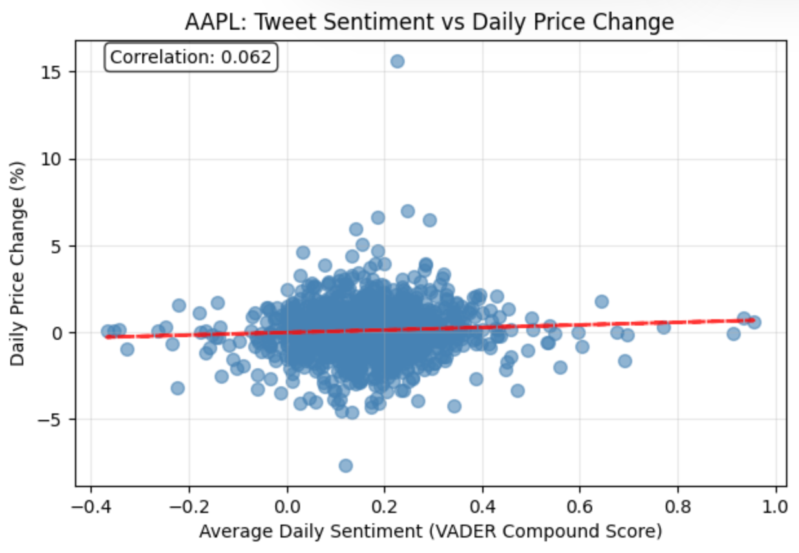
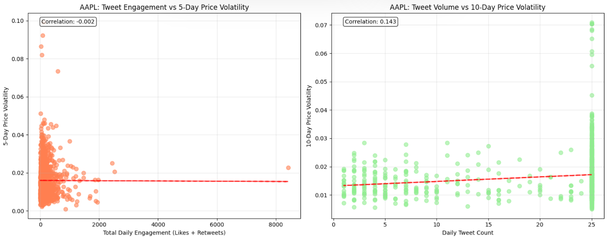

## Metadata

**Goal:**  
The goal of this project is to build a predictive model that estimates next-day stock trends based on public sentiment expressed in X (formerly Twitter) posts. By combining natural language processing with market data, our aim is to achieve at least 85% accuracy in predicting whether a stock’s price will rise or fall at market close.

**Summary:**  
We are investigating how social sentiment on X (formerly Twitter) influences short-term stock market behavior. Our approach leverages VADER sentiment analysis to quantify the tone of tweets mentioning stock tickers (e.g., `$AAPL`, `$TSLA`) and integrates those daily sentiment scores with financial data from Yahoo Finance via the `yfinance` API. Using supervised learning models starting with linear approaches and expanding to nonlinear ones (Random Forest, Gradient Boosting), we aim to uncover whether positive or negative online discussions can reliably forecast next-day market performance.

**License/Provenance:**  
All data used in this project is publicly available.

- Market data was collected using the `yfinance` package, which retrieves stock prices from Yahoo Finance.

- Tweet data was gathered using TwitterAPI.io, a third-party API that provides access to both real-time and historical X (Twitter) posts.
 
Both sources adhere to their respective Terms of Service, and all analyses are conducted using anonymized, aggregated data without revealing personal information from users.

**Data Dictionary:**

**Market Dataset (per stock ticker)**
| Variable Name      | Short Description                                                        | Example Values                                      |
|--------------------|--------------------------------------------------------------------------|-----------------------------------------------------|
| date               | The trading day for a given stock (datetime)                             | 2024-09-05                                          |
| open               | Opening stock price of the day                                           | 152.30                                              |
| close              | Closing stock price of the day                                           | 155.02                                              |
| trend_label        | Binary classification of price change (1 = price up, 0 = price down)     | 1                                                   |

**Tweet Dataset (per stock ticker)**
| Variable Name      | Short Description                                                        | Example Values                                      |
|--------------------|--------------------------------------------------------------------------|-----------------------------------------------------|
| text               | Text content of the tweet mentioning the stock                           | “Is owning $AAPL the best AI play?”                 |
| created_at         | Date and time the tweet was posted                                       | 2024-09-02 23:16:28+00:00                           |
| like_count         | Number of likes the tweet received                                       | 42                                                  |
| retweet_count      | Number of times the tweet was reposted                                   | 12                                                  |
| sentiment_score    | Computed sentiment score using VADER (-1 to +1)                          | 0.68                                                |

**Ethical Considerations:**
- All tweet data originates from publicly available posts, compliant with X’s Terms of Service.
- No private or identifying user information is stored or analyzed.
- Market data comes from reputable, open sources.
- Our models do not provide financial advice or guaranteed outcomes. They serve to explore correlations between sentiment and market movement.
- External sources and datasets are credited below.

**Goal put another way:**  
We want to understand how people’s tone and opinions about companies on X can predict short-term market trends. In other words, we aim to translate online sentiment into market signals, revealing whether optimism or pessimism on social media precedes measurable price shifts.

**Exploratory Plots:**

1. Average Daily Sentiment vs Stock Price Change (e.g., $AAPL) 
   
2. Tweet Volume vs Daily Volatility 
   

## References

[1] TwitterAPI.io, “Twitter API — Real-time and historical social data,” TwitterAPI.io. [Online]. Available: https://twitterapi.io/. [Accessed: Oct. 17, 2025].
[2] Yfinance, “yfinance: Yahoo! Finance market data downloader,” PyPI, 2025. [Online]. Available: https://pypi.org/project/yfinance/. [Accessed: Oct. 17, 2025].
[3] C. Hutto and E. Gilbert, “VADER: Valence Aware Dictionary and Sentiment Reasoner,” PyPI, 2025. [Online]. Available: https://pypi.org/project/vaderSentiment/. [Accessed: Oct. 10, 2025].
[4] P. R. de Lima, T. R. da Silva, and L. Pereira, “Twitter sentiment and stock market movements: The predictive power of social media,” Centre for Economic Policy Research (CEPR), VoxEU Column, 2020. [Online]. Available: https://cepr.org/voxeu/columns/twitter-sentiment-and-stock-market-movements-predictive-power-social-media. [Accessed: Oct. 10, 2025].